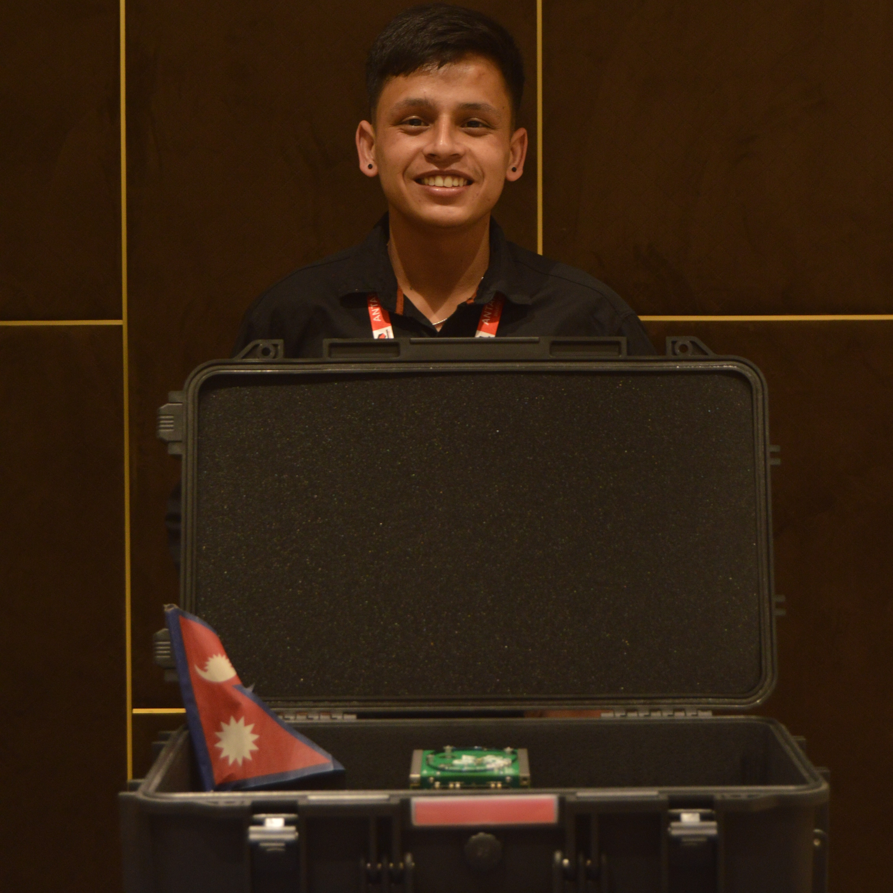

# Kushal KC Portfolio Website

## Overview
This is a personal portfolio website for **Kushal KC**, a Geomatics Engineer and Satellite Data Analyst based in Nepal. The website showcases professional skills, education, work experience, projects and a photo gallery. It is fully responsive, dynamic, and interactive, using **HTML, CSS, JavaScript and Bootstrap 5**.

---

## Features

* **Dynamic Content Loading**
  All sections (Education, Work Experience, Projects, Skills, and Gallery) are generated dynamically using JavaScript. This allows easy updates without editing HTML manually.

* **Typing Animation**
  A smooth typing animation on the home section introduces Kushal.

* **Skills Progress Animation**
  Animated skill bars show proficiency in GIS, Remote Sensing, WebGIS, and other tools. Animation triggers when the section is visible on the screen.

* **Projects Section with Modals**
  Projects are displayed in cards. Clicking "Read More" opens a modal with detailed project information.

* **Dynamic Gallery**
  Images are loaded dynamically from an array, with titles below each photo. Layout adapts to different screen sizes.

* **Responsive Design**
  Fully responsive layout using Bootstrap grid system, optimized for desktop, tablet, and mobile.

* **SEO & Social Media Friendly**
  Includes meta tags for search engines and Open Graph for social sharing.

---

## Technologies Used
* **HTML**
* **CSS3 & Bootstrap**
* **JavaScript**

---

## License
This project is **open-source** and available under the MIT License.

---

## Contact

**Kushal KC**

* Email: [your-email@example.com](mailto:kessikushal@gmail.com)
* Website: [https://www.kckushal.com.np](https://www.kckushal.com.np)
* LinkedIn: [linkedin.com/in/kushalkc](https://www.linkedin.com/in/kessikushal)

---